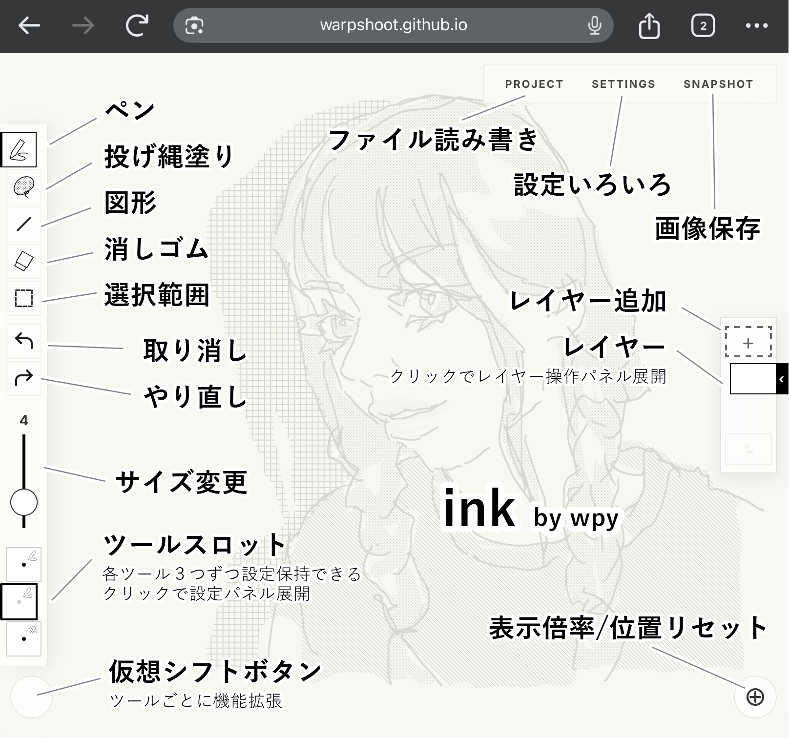

# ink ユーザーガイド (User Manual)

「ink」は、描き心地の良さと動作の軽さを追求した、Webブラウザで動くペイントツールです。

---

## 1. 基本コンセプト
気持ちいい描き心地と、シンプルで軽快な動作を特徴としています。
ペン描画、塗りつぶし、スクリーントーンなどの機能を備え、ストレスのない自由なドローイング体験を提供します。

## 2. モードとツール
画面左のツールバーで5つのメインモードを切り替えます。

### **ペンモード (Pen)**
- **ペン**: 標準的なペンツール。筆圧による太さの変化やアンチエイリアスの有無を設定可能です。
- **点描 (Stipple)**: ペンの筆圧に合わせて点の密度が変わる描画ツール。

### **塗りモード (Fill/Lasso)**
- **投げ縄塗り (Fill)**: 囲んだ範囲を塗りつぶします。
- **トーン (Screentone)**: 囲んだ範囲にスクリーントーンを配置。豊富なパターンから選択可能。
- **バケツ (Bucket)**: 各ツールの設定パネルで「バケツ有効」にすると、クリックによる塗りつぶしが可能です。

### **図形モード (Shape)**
ドラッグで幾何学図形を描きます。スロットをタップして設定パネルを開きます。
- **直線**: 始点から終点まで直線を引きます。Shift を押しながらドラッグすると 45° スナップ。
- **矩形**: 対角にドラッグして長方形を描きます。Shift で正方形に。
- **円**: ドラッグした領域に内接する楕円を描きます。Shift で真円に。
- **多角形 (Poly)**: 正多角形。角数は設定パネルで変更可。
- **スター (Star)**: 星形。角数・内径比率を設定パネルで変更可。

**設定オプション:**
- **塗りつぶし / 線描き**: 塗りと輪郭線を個別に ON/OFF。直線は塗りなし（グレーアウト）。
- **中心から描画**: ON にするとドラッグ開始点が図形の中心になります。
- **角度**: 図形の回転角度を 0〜359° で指定。直線には適用されません。
- **アンチエイリアス**: 輪郭のギザギザを滑らかにします。
- **プレビュー**: 設定変更・線幅スライダー操作後、画面中央に 2 秒間プレビューが表示されます。描画開始と同時に消えます。

### **消しゴムモード (Eraser)**
- **消しゴムペン**: ブラシでなぞった部分を消去。
- **投げ縄消去**: 囲んだ範囲を一気に消去。
- **全消し**: 選択中のレイヤーを即座にクリアします。

### **選択モード (Select)**
- **矩形選択 (Rect)** / **投げ縄選択 (Lasso)**: 範囲を指定して、以下の操作が可能です。
- **選択ツールバー**:
    - **移動**: 選択したピクセルをドラッグで移動。
    - **コピー/カット/ペースト**: 他のレイヤーへの複製や切り取り。
    - **削除**: 選択範囲をクリアします。
    - **解除**: 選択を解除してキャンバスに確定させます。

---

## 3. 高度な描画支援

### **手ぶれ補正 (糸引きスタビライザー)**
ペンや消しゴムの設定パネルから有効化できます。糸で引くような独特な操作感（String-pulling）により、震えを抑えた非常に滑らかな線を描くことができます。

### **レイヤー機能**
最大5枚のレイヤーを管理できます。
- **レイヤーメニュー**: レイヤーボタンをクリック（または長押し）すると、不透明度調整、表示切り替え、上下移動、下のレイヤーと統合、レイヤー削除のメニューが表示されます。

---

## 4. プロジェクト管理
画面右上の「PROJECT」メニューから操作します。
- **新規プロジェクト**: キャンバスをリセットし、新しい作業を開始。
- **プロジェクトの保存/読み込み**: 作業状態を `.json` 形式でローカルに保存・復元できます（ドラッグ＆ドロップでも読み込み可能）。
- **PSD形式で書き出し**: レイヤー構造を維持したまま Adobe Photoshop 形式（PSD）でエクスポートします。

---

## 5. 操作ガイド (Shortcuts & Gestures)

### **タッチ / ジェスチャー**
- **1本指**: 描画 / 投げ縄選択
- **2本指タップ**: 元に戻す (Undo)
- **3本指タップ**: やり直し (Redo)
- **ピンチ・スワイプ**: ズームと移動

### **キーボードショートカット**
- **X**: ペンと消しゴムの切り替え
- **S**: アクティブなツールの手振れ補正 ON/OFF 切り替え
- **Space + ドラッグ**: キャンバスの移動 (Pan)
- **Ctrl + Z**: Undo / **Ctrl + Y (or Shift+Ctrl+Z)**: Redo
- **Ctrl + C / X / V**: 選択範囲のコピー / カット / ペースト
- **Delete / Backspace**: 選択範囲の削除（未選択時は動作しません）
- **Esc**: 設定メニューを閉じる / 選択の解除
- **Ctrl + S**: 保存（Snapshot）メニューを開く

> [!TIP]
> ショートカット実行時には、画面中央に操作内容が通知（HUD）として表示されます。

---

## 6. 保存と書き出し (Snapshot)
「SNAPSHOT」メニューから、以下の書き出しが可能です。
- **Canvas (Full)**: キャンバス全体の画像を保存。
- **Crop (Range)**: 指定した範囲だけを切り出して保存。
- **背景透過**: 背景を透明にして書き出すか選択。
- **拡大率 (Scale)**: 1X, 2X, 3X の解像度で書き出し可能。

---

## 7. クレジット
- **名称**: ink
- **支給元**: [warpshoot.github.io/desu](https://warpshoot.github.io/desu/)
- **製造**: [wpy](https://warpshoot.github.io/)

---
*2026-04-17 Updated*

